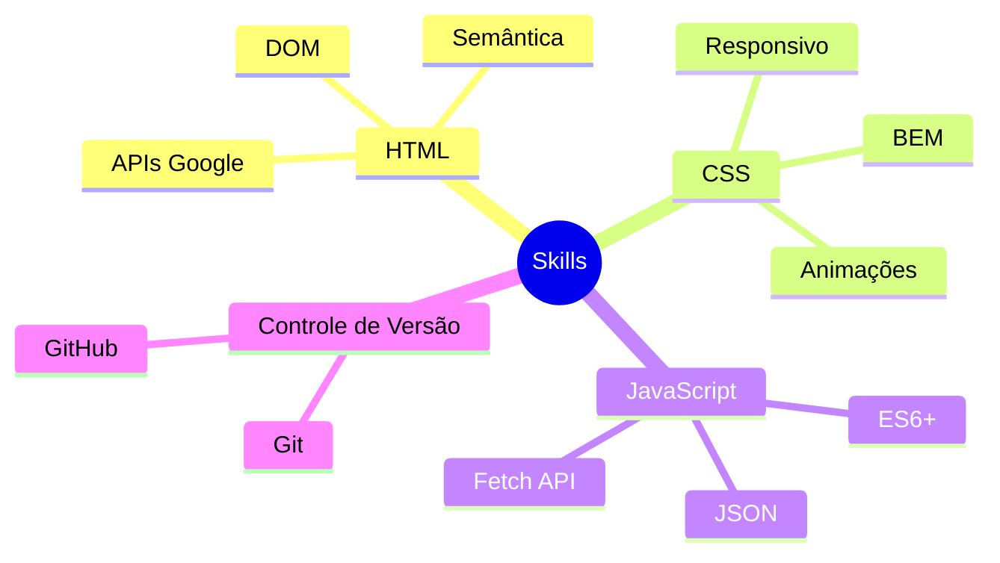

# Leonardo Constantino 👨‍💻

## 🚀 Sobre mim

Desenvolvedor Frontend apaixonado por criar experiências web excepcionais. Tenho um forte compromisso com código limpo e boas práticas de desenvolvimento. Atualmente, estou focado em aprofundar meus conhecimentos em React e suas tecnologias relacionadas, sempre buscando aprender e evoluir na área de desenvolvimento web.

## 💼 Habilidades Técnicas

### 🎯 Domínio Sólido

### 🌱 Em Desenvolvimento
- **Web Components**
  - Custom Elements
  - Shadow DOM
  - HTML Templates
- **Frameworks CSS**
  - Bootstrap
  - Tailwind CSS
  - Sass
- **Frameworks JS**
  - React
  - Next.js
  - Remix
- **Ferramentas de Build**
  - Webpack
  - Vite
  - Vitest
- **TypeScript**

## 🎨 Projetos em Destaque

### [🎮 Minigame de Sequência de Teclas](https://github.com/LeonardoConstantino/Desafio-Front-End)
Um desafiador minigame desenvolvido em React que testa suas habilidades de memória e reflexos.

**Tecnologias**: `React` `JavaScript` `CSS Modules`

### [🧮 Calculadora de Preço do Papel Higiênico](https://github.com/LeonardoConstantino/preco-papel)
Ferramenta prática que ajuda consumidores a encontrar a melhor relação custo-benefício em papel higiênico.

**Tecnologias**: `HTML` `CSS` `JavaScript`

### [📝 Formulário com Validação](https://github.com/LeonardoConstantino/formulario_com_validacao)
Implementação elegante de um formulário com validação em tempo real.

**Tecnologias**: `HTML` `CSS` `Validação Nativa`

## 🛠️ Stack Tecnológica

  

## 📊 Estatísticas GitHub

  
  
  
  
  

---

  
📚 Roadmap baseado em [roadmap.sh/frontend](https://roadmap.sh/frontend)

